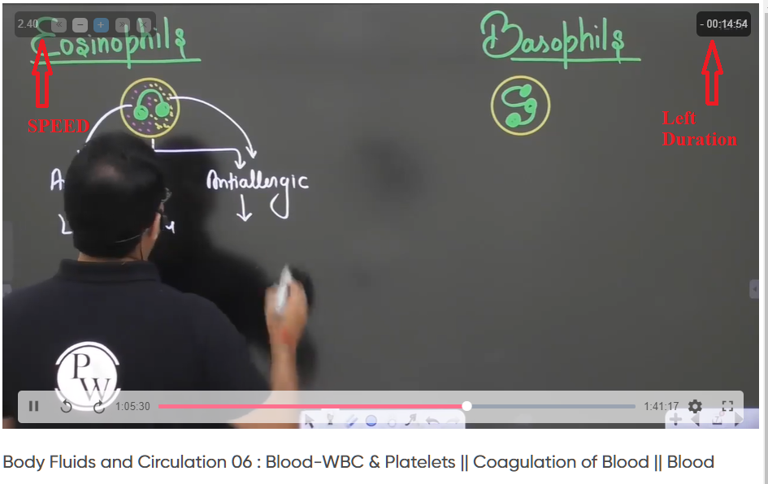

# Physics Wallah Video Controller(Chrome Extension)

## <ins>How to Download/Install:</ins>

- Click on <span style="background-color:#238636; ">Code 🢓</span>
- Click on "Download as ZIP" to download this repo
- Extract the ZIP file
  <br>
  <br>
- Open Chrome
- Click on three dot ( ⋮ ) (Near profile pic)
- More tools > Extensions
- Toggle the "Developer mode"
- Click on "Load unpacked"
- Redirect to the Extracted folder("physicswallah-video-control")
- Select forlder

## <ins>Features:</ins>

| Feature          | Keyboard Key  |
| ---------------- | ------------- |
| Volume Up        | Up Arrow ↑    |
| Volume Down      | Down Arrow ↓  |
| Video Forward    | Right Arrow → |
| Video Backward   | Left Arrow ←  |
| Video Speedup    | NUMPAD +      |
| Video Slowdown   | NUMPAD -      |
| Video Play/Pause | Spacebar      |

## <ins>Other features:</ins>

- Video duration shown as "left duration"(This also update with video speed up/down)

## <ins>To change the default values and key set:</ins>

Edit the inject.js file

```javascript
//assigning all variable(default values)
var tc = {
	settings: {
		lastSpeed: 1,
		speeds: {},
		//default values
		volJump: 0.1, //volume range 0 to 1-(volume go up/down by 0.1x
		vidSpeedJump: 0.1, //speed range 0 to 10-(vid speed go up/down by 0.1x)
		vidSeekJump: 5, //in seconds-(vid forward/backward by 5 sec)
		/*
		Shrotcut for media controller
		~~~~~~~~~~~~~~~~~~~~~~~~~~~~~
		->Change Shortcut by changing 'Key: ' value
		  e.g.speedDownKey: 109,

		->TO note your desired key press, set "findKeyCode: true"
		  Open console by pressing crtl+shift+J,
			press any key and note the keyName/keyCode
		*/
		findKeyCode: false, //default true
		speedDownKey: 109, //default key: 109 =>NUMPAD '-' for slowdown the video
		speedUpKey: 107, //default key: 107 => NUMPAD '+' for speedup the video
		backwardKey: 37, //default key: 37 =>left arrow for video backwarding
		forwardKey: 39, //default key: 39 =>rigt arrow for video forwarding
		volUpKey: 38, //default key: 38 =>up arrow key for volume up
		volDownKey: 40, //default key: 40 =>down arrow key for volume down
		volMuteKey: 77, //dfault key: 77 =>'m' letter to mute the video
		playPauseKey: 32, //default key: 32 =>Space Bar to play and pause the video

		controllerOpacity: 0.3,
		keyBindings: [],
		logLevel: 6,
	},
	// Holds a reference to all of the AUDIO/VIDEO DOM elements we've attached to
	mediaElements: [],
};
```

<br>

# <ins>Screenshot:</ins>


